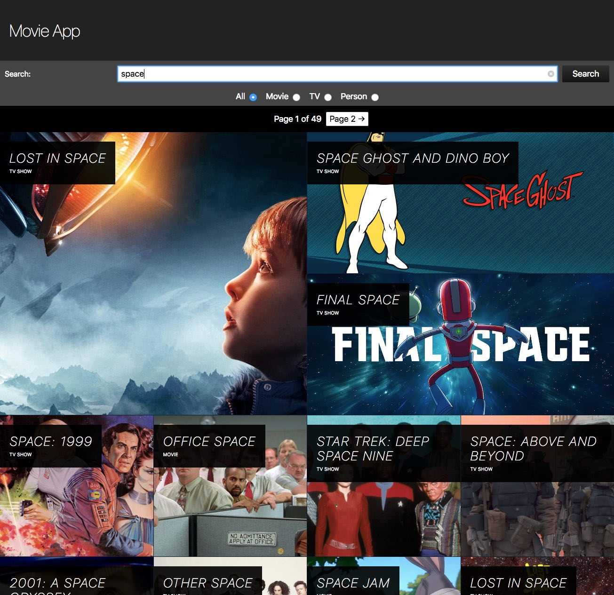

# The Movie DB app

A search app powered by the Movie DB API. It's built with TypeScript using React. The library [tmdb-typescript-api](https://github.com/xusoo/tmdb-typescript-api) is used to fetch data and get type definitions for the API (see Notes below).  



This project is still very much a WIP.

## Requirements:
- [Node.js](https://nodejs.org/)
- [yarn](https://yarnpkg.com/) (optional but recommended)

You will need to supply your own Movie DB API key. This can be found on [your Settings/API page](https://www.themoviedb.org/settings/api). Use the v3 auth key. 

## Get started:
```bash
# Clone repo 
$ git clone https://github.com/JodiWarren/moviedb-app.git

# Install dependencies
$ yarn 
 or
$ npm install

# Run tests
$ yarn test
 or
$ npm test

# Start dev server
$ yarn start
 or 
$ npm start
```

## Notes
The general rule of thumb is that the overall structure of the app roughly resembles the component tree, though it's by no means a rigorously applied rule.

API responess are cached with `sessionStorage`. This was chosen over the similarly simple `localStorage` as it self-invalidates. In the future, a more long-term storage solution such as localStorage or IndexedDB could be used with a retrieval timestamp in order to achieve fine-grained and managed cache invalidation.

There are currently some updates/fixes that have been made to `tmdb-typescript-api` but are not yet merged upstream. These have been published on NPM in a namespaced repo as `@jodi/tmdb-typescript-api`.

At time of writing, the tests are focusing on the non-presentational components, because they were developed test-first.

[Create React App TypeScript](https://github.com/wmonk/create-react-app-typescript) was used to bootstrap this project. You may want to read [the latest documentation for Create React App](https://github.com/facebook/create-react-app/blob/master/packages/react-scripts/template/README.md) for instructions on performing common tasks with this build process.

## Todo
### Features
- [ ] Accept user API key, and save it to localstorage
- [ ] Use responsive images so that large images aren't served to small screens
- [ ] Fall back to other images if `backdrop` is not available
- [ ] Expose more details on the search results page
  - [ ] popularity
  - [ ] genres
  - [ ] synopsis
  - [ ] video available
  - [ ] user rating
  - [ ] original language
- [ ] Filter search results based on above attributes
- [ ] Typeahead search
- [ ] Detail pages
- [ ] Routing, including...
- [ ] Using the URL to reflect/populate app state
- [ ] Nicer interface design
- [ ] Cache responses longer than a single session
- [ ] Authenticate & persist authentication

### Technical Debt
- [ ] Create a more robust schema for the API results storage
  - [ ] id-indexed object of individual results - better reuse and caching, including retrieval date
  - [ ] array of ids to determine result order
- [ ] test coverage calculator
- [ ] increase test coverage
- [ ] more codified project organisation
- [ ] manage side effects better
  - [ ] step 1: refactor API request functions
  - [ ] step 2: a considered use/orchestration of the returned Observables
- [ ] Replace default title and favicon
- [ ] Go through the codebase again and increase the length of this list